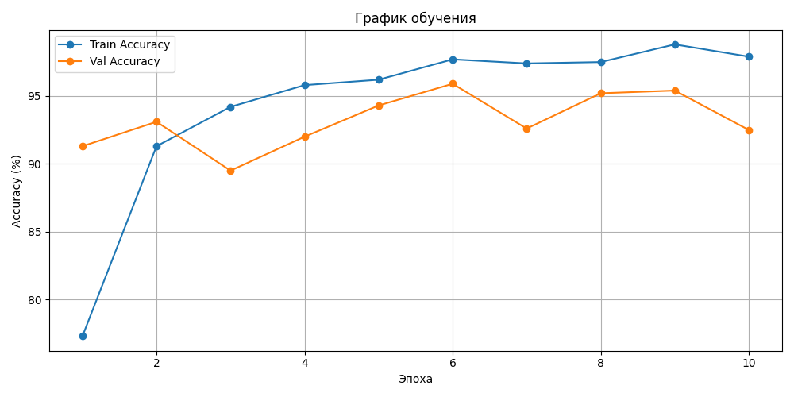
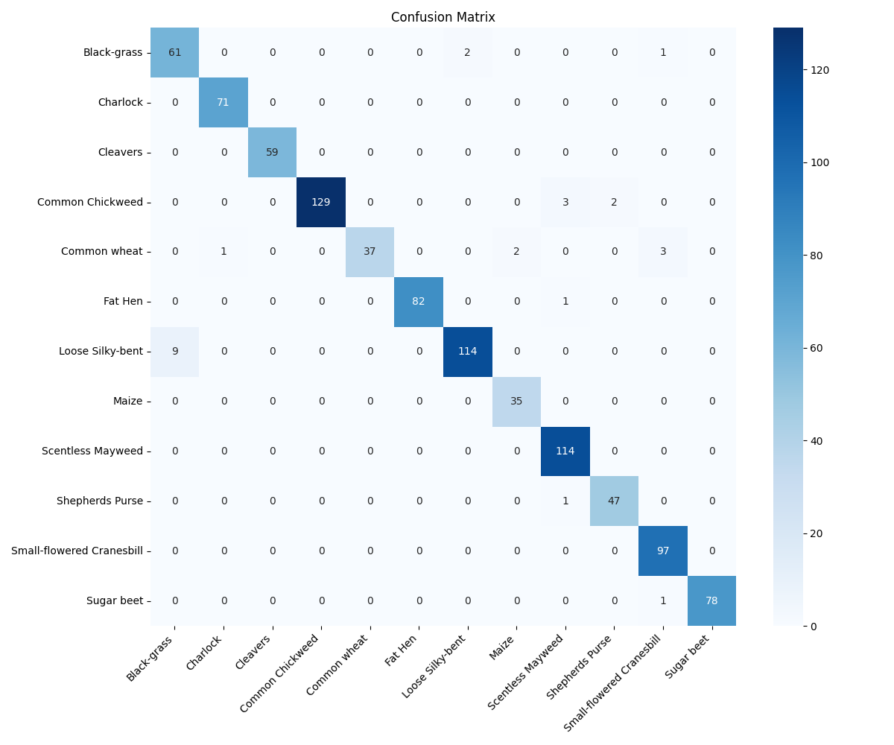

# Классификация видов растений по изображениям листьев

## Описание задачи
Мультиклассовая классификация изображений ростков растений. 
Модель определяет вид растения по фотографии среди 12 классов.

## Данные
- Датасет: [Plant Seedlings Classification (Kaggle)](https://www.kaggle.com/c/plant-seedlings-classification)
- 4750 изображений, 12 классов растений
- Классы: Black-grass, Charlock, Cleavers, Common Chickweed, Common wheat, Fat Hen, Loose Silky-bent, Maize, Scentless Mayweed, Shepherds Purse, Small-flowered Cranesbill, Sugar beet

## Архитектура модели
- **EfficientNet-B0** с предобученными весами ImageNet (fine-tuning)
- Последний слой заменён под 12 классов
- Оптимизатор: Adam (lr=0.001)
- Планировщик: ReduceLROnPlateau

## Data Augmentation
- RandomHorizontalFlip — случайное отражение
- RandomRotation(15) — поворот до 15 градусов
- ColorJitter — изменение яркости и контраста

## Результаты
| Метрика | Значение |
|---------|----------|
| Train Accuracy | 97.9% |
| Val Accuracy | 95.9% (макс) |

### График обучения


### Confusion Matrix


## Структура репозитория
```
plant-classification/
├── README.md
├── requirements.txt
├── src/
└── results/
    ├── training_plot.png
    └── confusion_matrix.png
```

## Запуск
1. Открыть ноутбук в Google Colab
2. Установить зависимости: `pip install -r requirements.txt`
3. Запустить все ячейки по порядку

## Лицензия
MIT
